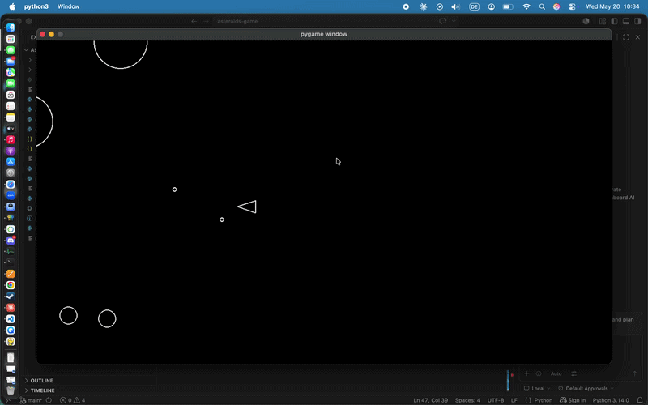

# Asteroids

A classic Asteroids arcade game built with Python and Pygame.



## Features

- Player ship with rotation and movement
- Asteroids that spawn and drift across the screen
- Shooting mechanic with cooldown timer
- Collision detection between player, shots, and asteroids
- Game over on player-asteroid collision

## Project Structure

```
asteroids/
├── main.py           # Entry point and game loop
├── constants.py      # Game configuration values
├── circleshape.py    # Base class for all game objects
├── player.py         # Player ship logic
├── asteroid.py       # Asteroid logic and splitting
├── asteroidfield.py  # Asteroid spawning
├── shot.py           # Projectile logic
├── logger.py         # State and event logging
└── IMG/
    └── asteroids_shoot_rotate.gif
```

## Requirements

- Python 3.x
- Pygame

Install dependencies:

```bash
pip install pygame
```

## Running the Game

```bash
python main.py
```

## Controls

| Key | Action |
|-----|--------|
| `W` | Thrust forward |
| `S` | Thrust backward |
| `A` | Rotate left |
| `D` | Rotate right |
| `Space` | Shoot |